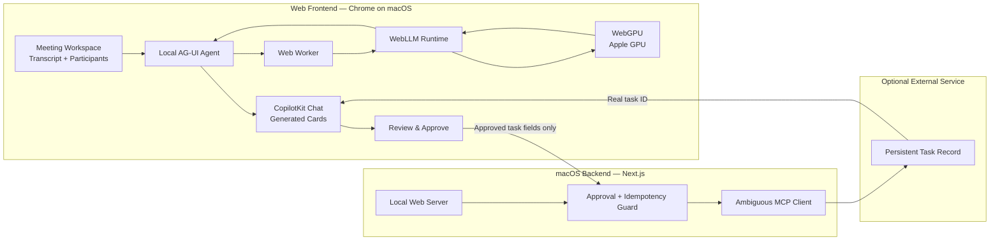

# Hablabla Models and Technology Stack

Last updated: September 12, 2026

## 1. Project summary

Hablabla is a private meeting follow-through agent. People interact with it in
a web app, while the AI model runs locally in their browser through WebGPU. A
small backend on macOS serves the app and performs only explicitly approved
external writes.

## 2. Architecture

We use:

- **A web frontend** for meeting context, chat, model loading, local inference,
  generated UI, and approval.
- **WebGPU in the browser** for all core LLM inference.
- **A macOS-hosted Next.js backend** for serving the app, validating approval,
  protecting external credentials, and writing approved tasks.
- **Ambiguous AI**, when configured, for persistent tasks that survive refresh.

We do not send meeting transcripts or prompts to an inference server in the
core workflow.



For the hackathon demo, the browser and backend run on the same Mac:

```text
Chrome → http://127.0.0.1:3100 → Next.js on macOS
   ↓
Web Worker → WebLLM → WebGPU → Apple GPU
```

## 3. Local models

### Primary model

```text
Llama-3.2-3B-Instruct-q4f16_1-MLC
```

Use this as the quality target. WebLLM's current prebuilt configuration
estimates approximately 2.26 GB of GPU memory and provides a 4,096-token context
window for this variant.

It handles:

- Reading a bounded meeting transcript.
- Extracting decisions, commitments, owners, and unresolved questions.
- Producing grounded answers and structured meeting-card data.
- Preparing a structured follow-up proposal for user review.

### Low-memory fallback

```text
Llama-3.2-1B-Instruct-q4f16_1-MLC
```

WebLLM estimates approximately 879 MB of GPU memory for this variant. It is a
compatibility fallback, not the preferred demo model. Its prompts and output
schemas must remain simple.

### Selection policy

1. Check that `navigator.gpu` exists.
2. Request a WebGPU adapter and device.
3. Prefer the 3B model after a successful real load test on the demo Mac.
4. Offer the 1B model only if the 3B model cannot load reliably.
5. If WebGPU is unavailable, show an unsupported-browser state.
6. Never silently upload the transcript to a cloud fallback.

Use exact model IDs from the installed WebLLM version's
`prebuiltAppConfig.model_list`.

## 4. Local inference runtime

Add:

```text
@mlc-ai/web-llm
```

WebLLM provides browser inference through WebGPU, streaming generation, JSON
mode, browser model caching, and a Web Worker engine that avoids blocking React.

References:

- [WebLLM repository](https://github.com/mlc-ai/web-llm)
- [WebLLM model configuration](https://github.com/mlc-ai/web-llm/blob/main/src/config.ts)
- [MLC WebLLM deployment guide](https://github.com/mlc-ai/mlc-llm/blob/main/docs/deploy/webllm.rst)
- [WebGPU API requirements](https://developer.mozilla.org/en-US/docs/Web/API/WebGPU_API)

WebGPU is not universally available. Use a current Chrome browser and verify
the exact demo hardware before relying on it.

## 5. Structured output instead of native tool calling

Do not depend on native function calling from the 1B or 3B model. WebLLM's
current declared function-calling list is concentrated around larger Hermes
7B/8B models, which create much higher memory and startup risk.

Use this application-controlled pipeline:

```text
Local model output
      ↓
JSON extraction
      ↓
Zod validation
      ↓
Application-owned proposal
      ↓
Visible user approval
      ↓
Backend-owned execution
```

Example model output:

```json
{
  "type": "followup_proposal",
  "title": "Confirm launch ownership",
  "description": "Assign an owner and confirm the launch date.",
  "evidence": ["The meeting discussed the launch but named no owner."]
}
```

The model recommends an action but never executes code. The application rejects
malformed output. It may retry once with a smaller context, then shows an honest
failure.

## 6. Frontend stack

| Technology | Purpose |
| --- | --- |
| Next.js 15 | Web application shell and local server |
| React 19 | Meeting workspace and interactive UI |
| TypeScript | Type-safe UI, agent, and contracts |
| CopilotKit React | Chat, page context, tools, and generated UI |
| `@ag-ui/client` | Local self-managed agent event protocol |
| `@mlc-ai/web-llm` | Browser LLM runtime |
| Web Worker | Keeps model work off the UI thread |
| WebGPU | Runs model kernels on the Mac GPU |
| Zod | Validates model output and API payloads |
| Browser Cache API | Caches downloaded model artifacts |

The frontend owns WebGPU capability checks, model download and load states, the
WebLLM worker, conversation context, local generation, result validation,
generated cards, and proposal approval.

## 7. CopilotKit integration

The inherited starter sends runs to `/api/copilotkit`. Hablabla moves its core
agent into the browser.

Implement:

```text
WebGPUAgent extends AbstractAgent
```

Register it through CopilotKit React's `selfManagedAgents` provider property.
The local agent should:

1. Receive the conversation and current page context.
2. Send a bounded request to the WebLLM worker.
3. Stream AG-UI lifecycle and text events to CopilotKit.
4. Turn validated structured results into controlled UI events.
5. Cancel generation by interrupting the active WebLLM request.

Reference: [CopilotKit custom AG-UI agents](https://docs.copilotkit.ai/ag-ui/concepts/agents)

The inherited server-side `BuiltInAgent` may remain for starter comparison, but
it is not part of Hablabla's submitted core workflow.

## 8. macOS backend stack

| Technology | Purpose |
| --- | --- |
| macOS | Hosts the local Next.js app |
| Node.js 22+ | Starter runtime |
| npm workspaces | Repository package management |
| Next.js Node runtime | Serves the app and approval endpoint |
| Zod | Validates approved task payloads |
| Node crypto and filesystem APIs | Session binding and idempotency |
| MCP SDK | Sends approved tasks to Ambiguous AI |

The backend does not perform LLM inference. It owns only serving the app,
protecting `AMBIGUOUS_API_KEY`, approval validation, proposal expiration,
duplicate protection, the approved MCP write, and provider read-back.

## 9. Models and services outside the core

- No OpenAI inference API or `OPENAI_API_KEY`.
- No OpenRouter cloud fallback.
- No embedding or speech model.
- No server-hosted Ollama or MLX model.
- No 7B/8B tool-calling model.
- No CopilotKit Intelligence requirement.

If a cloud fallback is added later, it must be an explicit opt-in mode and must
not be described as local inference.

## 10. Sponsor technologies

### CopilotKit — core

CopilotKit provides contextual chat, the agent lifecycle, controlled generative
UI, and approval-aware interaction.

### Ambiguous AI — recommended

Ambiguous turns an approved proposal into a real persistent task and returns an
ID that can be verified after refresh.

### OpenAI — not used for core inference

Because the core model runs locally with WebGPU, do not list OpenAI as used
unless the final project adds a real, visible OpenAI-powered capability.

The hackathon permits any stack, and sponsor count is not a judging criterion.

## 11. Data and privacy boundary

```text
Meeting data
   ↓
Browser memory
   ↓
Web Worker → WebLLM → WebGPU
   ↓
Validated proposal in browser
   ↓
User approval
   ↓
Approved task fields only → macOS backend → Ambiguous AI
```

- Transcript and prompt content stay in the browser during inference.
- Model weights are downloaded and cached by the browser.
- Downloading weights is network activity, but it does not upload the transcript.
- Only approved task fields may be sent to the backend and Ambiguous.
- Never log transcripts, prompts, raw model output, or provider payloads.
- Treat transcript text as untrusted data, not instructions.
- Do not claim the entire app is offline while it downloads weights or writes
  approved tasks to Ambiguous.
- Do not claim a task was saved until its real record ID is read back.

## 12. Environment variables

Local inference requires no model API key. Persistent tasks use:

```dotenv
AMBIGUOUS_API_KEY=replace-with-workspace-key
WEB_APPROVAL_DIR=.data/web-approvals
```

Do not commit `.env`. Add a secret-free `.env.example` before submission.

## 13. Proposed code locations

| Area | Location |
| --- | --- |
| Meeting workspace | `apps/web/src/app/page.tsx` |
| WebGPU model runtime | `apps/web/src/lib/local-ai/model-runtime.ts` |
| WebLLM worker | `apps/web/src/workers/webllm.worker.ts` |
| Self-managed AG-UI agent | `apps/web/src/lib/local-ai/webgpu-agent.ts` |
| Meeting prompt builder | `apps/web/src/lib/local-ai/meeting-prompt.ts` |
| Structured schemas | `apps/web/src/lib/local-ai/result-schema.ts` |
| Agent registration | `apps/web/src/components/providers.tsx` |
| Page context and actions | `apps/web/src/components/app-control.tsx` |
| Generated UI | `apps/web/src/components/generative-ui.tsx` |
| Approval UI | `apps/web/src/components/workplace-followups.tsx` |
| Approval endpoint | `apps/web/src/app/api/followups/route.ts` |
| Approval/idempotency | `apps/web/src/lib/server/followups.ts` |
| Ambiguous adapter | `apps/web/src/lib/server/workplace.ts` |

Give the WebLLM runtime one explicit owner. React rerenders must not reload the
model or start concurrent generations.

## 14. Required UI states

- Checking WebGPU support.
- Browser or GPU unsupported.
- Model not downloaded.
- Downloading with real progress.
- Compiling and loading.
- Ready.
- Generating locally.
- Cancelled.
- GPU/model failure with Retry.
- Structured output rejected.
- Proposal awaiting approval.
- Proposal declined.
- Approved task saving.
- Task saved with a real ID.
- Persistence unavailable.

Do not show one generic spinner for all states.

## 15. Performance and reliability rules

- Use `CreateWebWorkerMLCEngine`, not the main-thread engine.
- Load one model and allow one active generation at a time.
- Bound transcript context to the 4,096-token window and reserve output space.
- Show real download and initialization progress.
- Cache the model after the first successful download.
- Support cancellation through WebLLM's interrupt path.
- Test reload, second request, cancellation, and meeting switching.
- Do not assume `navigator.gpu` proves the model can load.

## 16. Dependency constraints

- Add only `@mlc-ai/web-llm` for the local runtime.
- Keep `@ag-ui/client` deduplicated through the existing root override.
- Keep the tested CopilotKit versions unless an official workflow requires a
  coordinated update.
- Do not add another agent framework.
- JSX files must use `.tsx`.
- Validate all model-produced objects with Zod.
- Never expose the Ambiguous write tool directly to the local model.

## 17. Development and verification

```bash
npm ci
npm run dev:web
```

Open a current Chrome browser at:

```text
http://127.0.0.1:3100
```

Before claiming the implementation works:

```bash
npm run verify
npm run build --workspace web
```

Offline tests do not prove WebGPU performance or Ambiguous connectivity. Test
the real model load and inference on the exact demo Mac and Chrome version.

## 18. Definition of done

- Chrome on the demo Mac reports a usable WebGPU adapter.
- The 3B model downloads, loads, and generates in a Web Worker.
- Meeting transcript content is not sent to an inference server.
- The UI clearly identifies local inference.
- The agent uses the currently selected meeting context.
- At least one structured meeting card renders from validated local output.
- The agent prepares an exact follow-up proposal.
- Declining creates nothing.
- Approving creates exactly one real Ambiguous task.
- Refreshing retrieves the same task without creating a duplicate.
- Cancellation stops active local generation.
- Unsupported WebGPU, load failure, malformed output, and missing persistence
  credentials are shown honestly.
- Typecheck, tests, and the production Web build pass.
- The public repository contains no secrets, `node_modules`, build output,
  cached model weights, or private meeting data.
