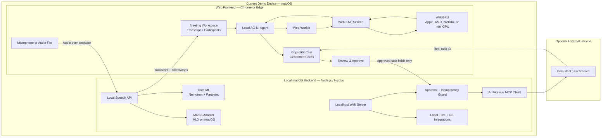

# Hablabla Models and Technology Stack

Last updated: September 12, 2026

For the full team implementation handbook, contracts, and named ownership, see
[TEAM_ARCHITECTURE.md](TEAM_ARCHITECTURE.md). William owns transcription and
speaker processing, Renzo owns backend data and analysis management, Ahmad owns
capture/transcript UI, and Arjun owns browser agent and analysis UI.

The current speaker-processing plan starts with local Python/PyTorch
`pyannote/speaker-diarization-community-1`, integrated behind William's speech
bridge. Diarization, manual naming, and optional enrolled speaker identification
are separate capabilities. See the handbook for alignment, storage, and
validation details and the
[Community-1 model card](https://huggingface.co/pyannote/speaker-diarization-community-1)
for download requirements and offline use. This adds a local Python dependency;
it does not require browser WebGPU or a hosted pyannote service.

## 1. Project summary

Hablabla is a private meeting follow-through agent with a web frontend and a
local desktop backend. The complete application runs on the user's macOS or
Windows computer in the long-term architecture. The current hackathon backend
runs on macOS. The primary LLM runs in the browser through WebGPU, while the
backend runs locally on the same Mac and never forwards model requests to a
cloud inference service.

## 2. Architecture

We use:

- **A web frontend** for meeting context, chat, model loading, WebGPU inference,
  generated UI, and approval.
- **WebGPU in the browser** for the core LLM.
- **A local macOS backend** for serving the app,
  validating approval, accessing local OS capabilities, protecting optional
  integration credentials, and writing approved tasks.
- **Ambiguous AI**, when configured, for persistent tasks that survive refresh.

All models run on the user's endpoint. We do not send meeting transcripts,
prompts, audio, embeddings, or model requests to a remote inference server.



The browser and backend always run on the same endpoint:

```text
Chrome or Edge → http://127.0.0.1:3100
                         ↓
                  Next.js backend on macOS

Browser Web Worker → WebLLM → WebGPU → local GPU
Browser audio → localhost speech API → native on-device speech runtime
```

The hackathon implementation targets macOS. Windows is a later platform target
and requires a tested replacement for each macOS-only model runtime.

## 3. Local models

### Primary browser reasoning model

```text
Llama-3.2-3B-Instruct-q4f16_1-MLC
```

Use this as the quality target. WebLLM's current prebuilt configuration
estimates approximately 2.26 GB of GPU memory and provides a 4,096-token context
window for this variant.

It handles:

- Reading a bounded meeting transcript.
- Extracting decisions, commitments, owners, and unresolved questions.
- Producing grounded answers and structured meeting-card data.
- Preparing a structured follow-up proposal for user review.

### Low-memory browser reasoning fallback

```text
Llama-3.2-1B-Instruct-q4f16_1-MLC
```

WebLLM estimates approximately 879 MB of GPU memory for this variant. It is a
compatibility fallback, not the preferred demo model. Its prompts and output
schemas must remain simple.

### Selection policy

1. Check that `navigator.gpu` exists.
2. Request a WebGPU adapter and device.
3. Prefer the 3B model after a successful real load test on the demo device.
4. Offer the 1B model only if the 3B model cannot load reliably.
5. If WebGPU is unavailable, show an unsupported-browser state.
6. Never silently upload the transcript to a cloud fallback.

Use exact model IDs from the installed WebLLM version's
`prebuiltAppConfig.model_list`.

### Speech models and WebGPU compatibility

The speech models do not share one browser runtime. "Runs on the endpoint" is
the product requirement; "runs through WebGPU" is only one possible execution
backend.

| Model | Browser WebGPU status | Local macOS/Windows path | MVP decision |
| --- | --- | --- | --- |
| `OpenMOSS-Team/MOSS-Transcribe-Diarize` | No documented WebGPU or ONNX Runtime Web implementation | Existing MLX implementation on Apple Silicon; Windows-native support remains unverified | Keep behind a macOS capability check; never advertise it on Windows until tested |
| `nvidia/parakeet-tdt-0.6b-v3` | Available through community `parakeet.js`; encoder uses WebGPU and decoder uses WASM | Existing Core ML implementation on macOS; NeMo-Speech.cpp is a future cross-platform option | Use the existing Core ML path for the Mac demo |
| `nvidia/nemotron-3.5-asr-streaming-0.6b` | No documented browser WebGPU implementation | Existing Core ML implementation on macOS; NeMo-Speech.cpp is a future cross-platform option | Use the existing Core ML path for streaming transcription |

Important format boundary:

- Existing Core ML Parakeet and Nemotron artifacts cannot be loaded directly by
  WebGPU. A browser implementation requires separate ONNX weights plus a
  compatible JavaScript preprocessing and decoding pipeline.
- `parakeet.js` is a community browser implementation, not the existing Core ML
  runtime and not an official NVIDIA WebGPU release.
- MOSS combines audio preprocessing, a Whisper-style encoder, an adaptor, a
  language-model decoder, timestamps, and diarization. Converting weights alone
  does not create a working WebGPU implementation.
- ONNX Runtime Web supports WebGPU in current Chrome/Edge on macOS and Windows,
  but its WebGPU execution provider supports only a defined operator subset.

References:

- [MOSS Transcribe-Diarize official repository](https://github.com/OpenMOSS/MOSS-Transcribe-Diarize)
- [NVIDIA NeMo-Speech.cpp](https://github.com/NVIDIA/NeMo-Speech.cpp)
- [Parakeet.js browser implementation](https://github.com/ysdede/parakeet.js)
- [ONNX Runtime Web compatibility](https://github.com/microsoft/onnxruntime/tree/main/js/web)
- [ONNX Runtime WebGPU operators](https://github.com/microsoft/onnxruntime/blob/main/js/web/docs/webgpu-operators.md)

## 4. Local inference runtimes

Add:

```text
@mlc-ai/web-llm
```

WebLLM provides browser LLM inference through WebGPU, streaming generation,
JSON mode, browser model caching, and a Web Worker engine that avoids blocking
React.

Speech inference uses a separate native process on the same endpoint:

```text
Web frontend
    ↓ localhost HTTP/WebSocket
Native Swift model bridge
    ├── Core ML → Nemotron 3.5 ASR Streaming
    ├── Core ML → Parakeet TDT 0.6B v3
    └── MLX → MOSS Transcribe-Diarize
```

Bind the bridge to `127.0.0.1`. NeMo-Speech.cpp supports Nemotron and Parakeet
through CPU, Metal, Vulkan, and CUDA and is a candidate for later Windows work;
it is not required for the current Mac demo. MOSS remains a separate local MLX
adapter because it is not supported by NeMo-Speech.cpp.

References:

- [WebLLM repository](https://github.com/mlc-ai/web-llm)
- [WebLLM model configuration](https://github.com/mlc-ai/web-llm/blob/main/src/config.ts)
- [MLC WebLLM deployment guide](https://github.com/mlc-ai/mlc-llm/blob/main/docs/deploy/webllm.rst)
- [WebGPU API requirements](https://developer.mozilla.org/en-US/docs/Web/API/WebGPU_API)

WebGPU is not universally available. Use a current Chrome or Edge browser and
verify the exact macOS or Windows demo hardware before relying on it.

## 5. Structured output instead of native tool calling

Do not depend on native function calling from the 1B or 3B model. WebLLM's
current declared function-calling list is concentrated around larger Hermes
7B/8B models, which create much higher memory and startup risk.

Use this application-controlled pipeline:

```text
Local model output
      ↓
JSON extraction
      ↓
Zod validation
      ↓
Application-owned proposal
      ↓
Visible user approval
      ↓
Backend-owned execution
```

Example model output:

```json
{
  "type": "followup_proposal",
  "title": "Confirm launch ownership",
  "description": "Assign an owner and confirm the launch date.",
  "evidence": ["The meeting discussed the launch but named no owner."]
}
```

The model recommends an action but never executes code. The application rejects
malformed output. It may retry once with a smaller context, then shows an honest
failure.

## 6. Frontend stack

| Technology | Purpose |
| --- | --- |
| Next.js 15 | Web application shell and cross-platform local backend |
| React 19 | Meeting workspace and interactive UI |
| TypeScript | Type-safe UI, agent, and contracts |
| CopilotKit React | Chat, page context, tools, and generated UI |
| `@ag-ui/client` | Local self-managed agent event protocol |
| `@mlc-ai/web-llm` | Browser LLM runtime |
| Web Worker | Keeps model work off the UI thread |
| WebGPU | Runs model kernels on the endpoint GPU |
| Zod | Validates model output and API payloads |
| Browser Cache API | Caches downloaded model artifacts |

The frontend owns WebGPU capability checks, model download and load states, the
WebLLM worker, conversation context, local generation, result validation,
generated cards, and proposal approval.

## 7. CopilotKit integration

The inherited starter sends runs to `/api/copilotkit`. Hablabla moves its core
agent into the browser.

Implement:

```text
WebGPUAgent extends AbstractAgent
```

Register it through CopilotKit React's `selfManagedAgents` provider property.
The local agent should:

1. Receive the conversation and current page context.
2. Send a bounded request to the WebLLM worker.
3. Stream AG-UI lifecycle and text events to CopilotKit.
4. Turn validated structured results into controlled UI events.
5. Cancel generation by interrupting the active WebLLM request.

Reference: [CopilotKit custom AG-UI agents](https://docs.copilotkit.ai/ag-ui/concepts/agents)

The inherited server-side `BuiltInAgent` may remain for starter comparison, but
it is not part of Hablabla's submitted core workflow.

## 8. Current macOS backend stack

| Technology | Purpose |
| --- | --- |
| macOS | Hosts the current backend on the user's computer |
| Node.js 22+ | Cross-platform backend runtime |
| npm workspaces | Repository package management |
| Next.js Node runtime | Serves the web frontend and local API endpoints |
| Zod | Validates approved task payloads |
| Node crypto and filesystem APIs | Session binding and idempotency |
| Native Swift model bridge | Exposes existing model runtimes over loopback |
| Core ML | Current Nemotron and Parakeet inference |
| MLXAudioMOSS | MOSS inference on supported Apple Silicon Macs |
| MCP SDK | Sends approved tasks to Ambiguous AI |

The backend binds to `127.0.0.1`, not the public network. It owns serving the
app, local file and OS integration, protecting `AMBIGUOUS_API_KEY`, approval
validation, proposal expiration, duplicate protection, the approved MCP write,
and provider read-back.

The LLM runs in the browser through WebGPU. The current Mac backend can run the
existing Core ML Nemotron and Parakeet implementations and the separate MLX
MOSS implementation. NeMo-Speech.cpp is a possible later shared native runtime,
but adopting it is not required for the Mac hackathon demo. No component may
silently switch to a cloud inference API.

## 9. Remote model services outside the architecture

- No OpenAI inference API or `OPENAI_API_KEY`.
- No OpenRouter cloud fallback.
- No remote server-hosted Ollama, MLX, or model API.
- No 7B/8B tool-calling model.
- No CopilotKit Intelligence requirement.

Every LLM, speech, embedding, vision, or reranking model must run either in the
browser or in the local macOS backend. A remote-model fallback is outside this
architecture.

## 10. Sponsor technologies

### CopilotKit — core

CopilotKit provides contextual chat, the agent lifecycle, controlled generative
UI, and approval-aware interaction.

### Ambiguous AI — recommended

Ambiguous turns an approved proposal into a real persistent task and returns an
ID that can be verified after refresh.

### OpenAI — not used for core inference

Because the core model runs locally with WebGPU, do not list OpenAI as used
unless the final project adds a real, visible OpenAI-powered capability.

The hackathon permits any stack, and sponsor count is not a judging criterion.

## 11. Data and privacy boundary

```text
Microphone or audio file
   ↓
Browser → loopback-only speech API
   ↓
Nemotron / Parakeet / MOSS on the same endpoint
   ↓
Transcript returned to browser
   ↓
Web Worker → WebLLM → WebGPU on the same endpoint
   ↓
Validated proposal in browser
   ↓
User approval
   ↓
Approved task fields only → local macOS backend → Ambiguous AI
```

- Audio, transcripts, prompts, and intermediate results stay on the user's
  endpoint during model inference.
- LLM weights are downloaded and cached by the browser. Native speech weights
  are cached by their local runtime.
- Downloading weights is network activity, but it does not upload meeting data.
- The frontend talks to the backend only through loopback (`127.0.0.1`).
- The backend must reject non-loopback requests and unexpected browser origins.
- Audio and meeting data may reach the local backend for on-device processing
  and storage. Only approved task fields may leave the endpoint for Ambiguous.
- Never log transcripts, prompts, raw model output, or provider payloads.
- Treat transcript text as untrusted data, not instructions.
- Do not claim the entire app is offline while it downloads weights or writes
  approved tasks to Ambiguous.
- Do not claim a task was saved until its real record ID is read back.

## 12. Environment variables

Local inference requires no model API key. Persistent tasks use:

```dotenv
LOCAL_SPEECH_BASE_URL=http://127.0.0.1:8765
AMBIGUOUS_API_KEY=replace-with-workspace-key
WEB_APPROVAL_DIR=.data/web-approvals
```

Do not commit `.env`. Add a secret-free `.env.example` before submission.

## 13. Proposed code locations

| Area | Location |
| --- | --- |
| Meeting workspace | `apps/web/src/app/page.tsx` |
| WebGPU model runtime | `apps/web/src/lib/local-ai/model-runtime.ts` |
| WebLLM worker | `apps/web/src/workers/webllm.worker.ts` |
| Self-managed AG-UI agent | `apps/web/src/lib/local-ai/webgpu-agent.ts` |
| Meeting prompt builder | `apps/web/src/lib/local-ai/meeting-prompt.ts` |
| Structured schemas | `apps/web/src/lib/local-ai/result-schema.ts` |
| Local speech client | `apps/web/src/lib/local-speech/client.ts` |
| Speech capabilities | `apps/web/src/lib/local-speech/capabilities.ts` |
| Nemotron/Parakeet adapter | `apps/web/src/lib/local-speech/nemo-speech.ts` |
| MOSS adapter | `apps/web/src/lib/local-speech/moss.ts` |
| Agent registration | `apps/web/src/components/providers.tsx` |
| Page context and actions | `apps/web/src/components/app-control.tsx` |
| Generated UI | `apps/web/src/components/generative-ui.tsx` |
| Approval UI | `apps/web/src/components/workplace-followups.tsx` |
| Local backend API | `apps/web/src/app/api/` |
| Approval endpoint | `apps/web/src/app/api/followups/route.ts` |
| Approval/idempotency | `apps/web/src/lib/server/followups.ts` |
| Ambiguous adapter | `apps/web/src/lib/server/workplace.ts` |

Give the WebLLM runtime one explicit owner. React rerenders must not reload the
model or start concurrent generations.

## 14. Required UI states

- Checking WebGPU support.
- Browser or GPU unsupported.
- Checking local speech service.
- Nemotron or Parakeet loading locally.
- Selected speech model unavailable on this platform.
- MOSS disabled on Windows until its local runtime is implemented and tested.
- Model not downloaded.
- Downloading with real progress.
- Compiling and loading.
- Ready.
- Generating locally.
- Cancelled.
- GPU/model failure with Retry.
- Structured output rejected.
- Proposal awaiting approval.
- Proposal declined.
- Approved task saving.
- Task saved with a real ID.
- Persistence unavailable.

Do not show one generic spinner for all states.

## 15. Performance and reliability rules

- Use `CreateWebWorkerMLCEngine`, not the main-thread engine.
- Load one model and allow one active generation at a time.
- Keep the native speech process outside the browser UI thread.
- Load only the selected speech model; do not keep MOSS, Nemotron, and Parakeet
  resident simultaneously.
- Bound transcript context to the 4,096-token window and reserve output space.
- Show real download and initialization progress.
- Cache the model after the first successful download.
- Support cancellation through WebLLM's interrupt path.
- Test reload, second request, cancellation, and meeting switching.
- Do not assume `navigator.gpu` proves the model can load.

## 16. Dependency constraints

- Use `@mlc-ai/web-llm` as the only browser LLM runtime.
- Keep NeMo-Speech.cpp as a future Windows option rather than a hackathon
  dependency unless the team explicitly changes the current Mac plan.
- Do not add `parakeet.js` unless the team explicitly chooses browser ASR and
  accepts its hybrid WebGPU/WASM path.
- Keep `@ag-ui/client` deduplicated through the existing root override.
- Keep the tested CopilotKit versions unless an official workflow requires a
  coordinated update.
- Do not add another agent framework.
- JSX files must use `.tsx`.
- Validate all model-produced objects with Zod.
- Never expose the Ambiguous write tool directly to the local model.

## 17. Development and verification

```bash
npm ci
npm run dev:web
```

Open a current Chrome or Edge browser on macOS at:

```text
http://127.0.0.1:3100
```

Before claiming the implementation works:

```bash
npm run verify
npm run build --workspace web
```

Offline tests do not prove WebGPU performance, native speech inference, or
Ambiguous connectivity. Test the real model loads and inference on the exact
demo device and browser version.

## 18. Definition of done

- Chrome or Edge on the demo Mac reports a usable WebGPU adapter.
- The backend is reachable only from the local endpoint.
- The 3B model downloads, loads, and generates in a Web Worker.
- Nemotron and Parakeet capability checks reflect the installed local runtime.
- The selected speech model can transcribe a real audio sample locally.
- MOSS is enabled only where its local runtime has been exercised successfully.
- Meeting audio and transcript content are not sent to a remote inference server.
- The UI clearly identifies local inference.
- The agent uses the currently selected meeting context.
- At least one structured meeting card renders from validated local output.
- The agent prepares an exact follow-up proposal.
- Declining creates nothing.
- Approving creates exactly one real Ambiguous task.
- Refreshing retrieves the same task without creating a duplicate.
- Cancellation stops active local generation.
- Unsupported WebGPU, load failure, malformed output, and missing persistence
  credentials are shown honestly.
- Typecheck, tests, and the production Web build pass.
- The public repository contains no secrets, `node_modules`, build output,
  cached model weights, or private meeting data.
