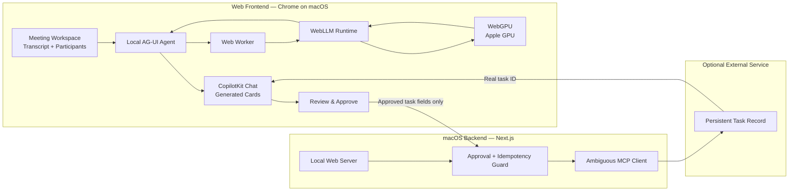

# Hablabla Models and Technology Stack

Last updated: September 12, 2026

## Implementation status and coordination — September 12, 2026

**Read this section before changing the project.** There are now two workstreams:

1. **Meeting workspace:** the existing web UI and browser-local meeting assistant described in sections 1–18.
2. **Computer companion:** the user's separate, planned Mac device-control workstream described in sections 19–23. It may use server-side AI with explicit screen-sharing consent. It must not silently change the meeting workspace's privacy boundary.

### What is implemented

| Area | Current state |
| --- | --- |
| Meeting UI at `/` | Implemented: green/cream workspace, meeting navigation and search, Overview / Transcript / Action items tabs, participants, source evidence, suggested-action review, and Markdown recap download. |
| Import and editing | Paste a transcript or notes, edit it, and switch meetings. Imported meetings and chats are session-memory only; refreshing clears them. Edited samples receive a new meeting ID and do not retain an outdated example recap. |
| Accessibility | Native dialogs and controls, labels, skip link, keyboard tabs with arrows/Home/End, focus styling, status announcements, reduced-motion rules, and responsive layouts. Checked at 320px, 390px, and 1280px; no horizontal overflow was observed. Small-text contrast was audited and adjusted. This is not a formal accessibility certification. |
| Sample content | Three fictional meetings. The launch meeting has an **authored example recap**, explicitly labeled in the UI. It is not evidence that the local model generated a result. |
| Local AI integration | Implemented `WebGPUAgent`, CopilotKit registration, one WebLLM worker, capability checks, real initialization progress, streaming, cancellation path, retry/fallback states, and interrupted-session recovery. |
| Validated recap cards | Zod checks summary, decisions, actions, and questions. Decision/action evidence must occur in the supplied transcript. Invalid output produces an error and no proposal. |
| Context limits | Requests use a conservative UTF-8 excerpt budget under 2,900 bytes, reserving room for generation in a 4,096-token window. A long meeting is not fully analyzed. Each chat question uses the selected transcript and latest question, not earlier chat turns. |
| Review and persistence | Suggestions remain local until **Continue to approval** sends task fields to the backend. **Approve & save** acts on immutable server-held fields and requires matching provider read-back. **Decline** creates no task. Existing session, expiry, identity, and duplicate-write guards support meeting IDs. Saved records can be retrieved by ID in Action items. |
| Preserved templates | The original incident page is at `/reference`; `/voice` remains the inherited optional example. These routes retain their original server-runtime integration and are separate from the home page. |
| Repository hygiene | Root `.gitignore` excludes credentials, dependencies, caches, build/test output, logs, deployment state, and OS/editor artifacts. `.env.example` contains placeholders only. |

### What was verified, and what is deferred

- `npm run verify` passed **97 tests** across the existing workspaces, including new local-agent, schema, context-budget, and meeting-approval tests. These tests use stubs/fake providers for inference and writes.
- `npm run build --workspace web` passed, including TypeScript validation. The inherited server SDK emits a dynamic-dependency warning; it did not prevent the build.
- Browser checks exercised keyboard tab navigation, sample action review/decline, transcript import, and desktop/mobile layouts.
- The in-app browser reported a usable WebGPU device, downloaded **Llama 3.2 3B**, and reached Ready. The browser session restarted during the first real generation attempt. Its cause has not been established; **successful real generation is not verified**.
- **Local AI generation verification is explicitly deferred at the user's request. Do not restart model downloads, inference experiments, or GPU troubleshooting unless the user asks to resume.** Keep the implementation and error states intact.
- Real generation quality, generated-card delivery, repeat requests, cancellation, and the 1B fallback still need live hardware verification. Unit tests do not establish these live behaviors.
- Ambiguous was not configured for the UI verification. No real task was written; live approval/read-back still needs a configured test workspace and an authorized test.
- The Mac companion, device dashboard, pairing/relay service, screen streaming, and remote input are **planned, not implemented in this frontend change**. The current homepage is a meeting dashboard, not a remote desktop.

### Files and ownership

| Workstream / owner | Owned or reserved paths | Coordination boundary |
| --- | --- | --- |
| Meeting frontend | `apps/web/src/app/page.tsx`, `apps/web/src/app/workspace.css`, `apps/web/src/components/{icons,meeting-dialog,model-status}.tsx`, `apps/web/src/lib/{meetings,meeting-examples}.ts` | Preserve the completed workspace when adding the device dashboard. |
| Meeting local AI; verification paused | `apps/web/src/lib/local-ai/`, `apps/web/src/workers/webllm.worker.ts` | Do not replace with cloud inference or resume live tests as a side effect of companion work. |
| Existing meeting approval backend | `apps/web/src/app/api/followups/`, `apps/web/src/lib/server/`, `apps/web/src/lib/followup-*` | Keep existing approval behavior. Device commands use a separate contract and service. |
| **Mac companion — reserved for the user / their companion agent** | Proposed `apps/companion/` and native helper files underneath it | Do not scaffold, rewrite, relocate, or implement this area as part of a frontend-only task. Follow an explicit companion assignment. |
| Device dashboard — future frontend task | Proposed `apps/web/src/app/devices/`, `apps/web/src/components/devices/`, `apps/web/src/lib/devices/` | Add a separate `/devices` route; coordinate any shared navigation/layout/provider changes. |
| Pairing and communication — future backend task | Proposed `apps/relay/` | Backend owner builds authenticated device registry, pairing, command delivery, results, and stream signaling. Do not assume this service exists yet. |
| Shared device protocol — joint interface review | Proposed `packages/device-protocol/`; initial design in section 21 | Agree on schemas before either side implements them. One owner lands shared contract changes; consumers update together. |
| Shared root configuration | `package.json`, `package-lock.json`, `AGENTS.md`, `TECH_STACK.md`, `apps/web/src/app/layout.tsx`, `apps/web/src/components/providers.tsx`, `apps/web/next.config.ts` | Coordinate edits. The current provider registers a browser-local agent; isolate `/devices` if it needs different agent/auth providers. Root scripts currently include only the established web/channel workspaces. |

The proposed paths reserve boundaries; they are not a report of existing files. If the companion owner already has a different directory or protocol, record that existing choice here before connecting the components. Do not move their work to match a proposed path without an explicit assignment.

For parallel work, use a separate branch/worktree for each assigned component. Do not stage or commit another contributor's unfinished files. Record interface changes and verification outcomes here. Do not launch companion or backend sub-agents from the example prompt alone; assign those tasks explicitly when ready.


## 1. Meeting-workspace summary

Hablabla is a private meeting follow-through agent. People interact with it in
a web app, while the AI model runs locally in their browser through WebGPU. A
small backend on macOS serves the app and performs only explicitly approved
external writes.

## 2. Meeting-workspace architecture

We use:

- **A web frontend** for meeting context, chat, model loading, local inference,
  generated UI, and approval.
- **WebGPU in the browser** for all core LLM inference.
- **A macOS-hosted Next.js backend** for serving the app, validating approval,
  protecting external credentials, and writing approved tasks.
- **Ambiguous AI**, when configured, for persistent tasks that survive refresh.

We do not send meeting transcripts or prompts to an inference server in the
core workflow.



For the hackathon demo, the browser and backend run on the same Mac:

```text
Chrome → http://127.0.0.1:3100 → Next.js on macOS
   ↓
Web Worker → WebLLM → WebGPU → Apple GPU
```

## 3. Local models

### Primary model

```text
Llama-3.2-3B-Instruct-q4f16_1-MLC
```

Use this as the quality target. WebLLM's current prebuilt configuration
estimates approximately 2.26 GB of GPU memory and provides a 4,096-token context
window for this variant.

It handles:

- Reading a bounded meeting transcript.
- Extracting decisions, commitments, owners, and unresolved questions.
- Producing grounded answers and structured meeting-card data.
- Preparing a structured follow-up proposal for user review.

### Low-memory fallback

```text
Llama-3.2-1B-Instruct-q4f16_1-MLC
```

WebLLM estimates approximately 879 MB of GPU memory for this variant. It is a
compatibility fallback, not the preferred demo model. Its prompts and output
schemas must remain simple.

### Selection policy

1. Check that `navigator.gpu` exists.
2. Request a WebGPU adapter and device.
3. Prefer the 3B model after a successful real load test on the demo Mac.
4. Offer the 1B model only if the 3B model cannot load reliably.
5. If WebGPU is unavailable, show an unsupported-browser state.
6. Never silently upload the transcript to a cloud fallback.

Use exact model IDs from the installed WebLLM version's
`prebuiltAppConfig.model_list`.

## 4. Local inference runtime

Installed in the web workspace (lockfile version 0.2.85):

```text
@mlc-ai/web-llm
```

WebLLM provides browser inference through WebGPU, streaming generation, JSON
mode, browser model caching, and a Web Worker engine that avoids blocking React.

References:

- [WebLLM repository](https://github.com/mlc-ai/web-llm)
- [WebLLM model configuration](https://github.com/mlc-ai/web-llm/blob/main/src/config.ts)
- [MLC WebLLM deployment guide](https://github.com/mlc-ai/mlc-llm/blob/main/docs/deploy/webllm.rst)
- [WebGPU API requirements](https://developer.mozilla.org/en-US/docs/Web/API/WebGPU_API)

WebGPU is not universally available. Use a current Chrome browser and verify
the exact demo hardware before relying on it.

## 5. Structured output instead of native tool calling

Do not depend on native function calling from the 1B or 3B model. WebLLM's
current declared function-calling list is concentrated around larger Hermes
7B/8B models, which create much higher memory and startup risk.

Use this application-controlled pipeline:

```text
Local model output
      ↓
JSON extraction
      ↓
Zod validation
      ↓
Application-owned proposal
      ↓
Visible user approval
      ↓
Backend-owned execution
```

Illustrative action shape (not the current top-level parser contract):

```json
{
  "type": "followup_proposal",
  "title": "Confirm launch ownership",
  "description": "Assign an owner and confirm the launch date.",
  "evidence": ["The meeting discussed the launch but named no owner."]
}
```

The implemented parser in `result-schema.ts` expects a recap object with `summary`, `decisions`, `actions`, and `questions`. Each decision and action includes a source quote; the example above is conceptual and must not be passed directly to that parser.

The model recommends an action but never executes code. The application rejects
malformed output. It may retry once with a smaller context, then shows an honest
failure.

## 6. Frontend stack

| Technology | Purpose |
| --- | --- |
| Next.js 15 | Web application shell and local server |
| React 19 | Meeting workspace and interactive UI |
| TypeScript | Type-safe UI, agent, and contracts |
| CopilotKit React | Chat, page context, tools, and generated UI |
| `@ag-ui/client` | Local self-managed agent event protocol |
| `@mlc-ai/web-llm` | Browser LLM runtime |
| Web Worker | Keeps model work off the UI thread |
| WebGPU | Runs model kernels on the Mac GPU |
| Zod | Validates model output and API payloads |
| Browser Cache API | Caches downloaded model artifacts |

The frontend owns WebGPU capability checks, model download and load states, the
WebLLM worker, conversation context, local generation, result validation,
generated cards, and proposal approval.

## 7. CopilotKit integration

The inherited starter sends runs to `/api/copilotkit`. Hablabla moves its core
agent into the browser.

Implemented:

```text
WebGPUAgent extends AbstractAgent
```

It is registered through CopilotKit React's `selfManagedAgents` provider property.
The local agent implements the following flow; see the deferred live-verification status above:

1. Receive the conversation and current page context.
2. Send a bounded request to the WebLLM worker.
3. Stream AG-UI lifecycle and text events to CopilotKit.
4. Turn validated structured results into controlled UI events.
5. Cancel generation by interrupting the active WebLLM request.

Reference: [CopilotKit custom AG-UI agents](https://docs.copilotkit.ai/ag-ui/concepts/agents)

The inherited server-side `BuiltInAgent` may remain for starter comparison, but
it is not part of Hablabla's submitted core workflow.

## 8. Meeting approval backend stack

| Technology | Purpose |
| --- | --- |
| macOS | Hosts the local Next.js app |
| Node.js 22+ | Starter runtime |
| npm workspaces | Repository package management |
| Next.js Node runtime | Serves the app and approval endpoint |
| Zod | Validates approved task payloads |
| Node crypto and filesystem APIs | Session binding and idempotency |
| MCP SDK | Sends approved tasks to Ambiguous AI |

The backend does not perform LLM inference. It owns only serving the app,
protecting `AMBIGUOUS_API_KEY`, approval validation, proposal expiration,
duplicate protection, the approved MCP write, and provider read-back.

## 9. Models and services outside the meeting core

- No OpenAI inference API or `OPENAI_API_KEY`.
- No OpenRouter cloud fallback.
- No embedding or speech model.
- No server-hosted Ollama or MLX model.
- No 7B/8B tool-calling model.
- No CopilotKit Intelligence requirement.

If a cloud fallback is added later, it must be an explicit opt-in mode and must
not be described as local inference.

## 10. Sponsor technologies

### CopilotKit — core

CopilotKit provides contextual chat, the agent lifecycle, controlled generative
UI, and approval-aware interaction.

### Ambiguous AI — recommended

Ambiguous turns an approved proposal into a real persistent task and returns an
ID that can be verified after refresh.

### OpenAI — not used for core inference

Because the core model runs locally with WebGPU, do not list OpenAI as used
unless the final project adds a real, visible OpenAI-powered capability.

The hackathon permits any stack, and sponsor count is not a judging criterion.

## 11. Meeting-workspace data and privacy boundary

```text
Meeting data
   ↓
Browser memory
   ↓
Web Worker → WebLLM → WebGPU
   ↓
Validated proposal in browser
   ↓
User approval
   ↓
Approved task fields only → macOS backend → Ambiguous AI
```

- Transcript and prompt content stay in the browser during inference.
- Model weights are downloaded and cached by the browser.
- Downloading weights is network activity, but it does not upload the transcript.
- Only approved task fields may be sent to the backend and Ambiguous.
- Never log transcripts, prompts, raw model output, or provider payloads.
- Treat transcript text as untrusted data, not instructions.
- Do not claim the entire app is offline while it downloads weights or writes
  approved tasks to Ambiguous.
- Do not claim a task was saved until its real record ID is read back.

## 12. Environment variables

Local inference requires no model API key. Persistent tasks use:

```dotenv
AMBIGUOUS_API_KEY=replace-with-workspace-key
WEB_APPROVAL_DIR=.data/web-approvals
```

Do not commit `.env`. The root `.env.example` now contains placeholder configuration only.

## 13. Current meeting-workspace code locations

| Area | Location |
| --- | --- |
| Meeting workspace | `apps/web/src/app/page.tsx` |
| WebGPU model runtime | `apps/web/src/lib/local-ai/model-runtime.ts` |
| WebLLM worker | `apps/web/src/workers/webllm.worker.ts` |
| Self-managed AG-UI agent | `apps/web/src/lib/local-ai/webgpu-agent.ts` |
| Meeting prompt builder | `apps/web/src/lib/local-ai/meeting-prompt.ts` |
| Structured schemas | `apps/web/src/lib/local-ai/result-schema.ts` |
| Agent registration | `apps/web/src/components/providers.tsx` |
| Meeting page context, chat, actions, and generated cards | `apps/web/src/app/page.tsx` |
| Meeting styles | `apps/web/src/app/workspace.css` |
| Model status and dialog UI | `apps/web/src/components/model-status.tsx`, `apps/web/src/components/meeting-dialog.tsx` |
| Sample meeting data and authored recap | `apps/web/src/lib/meetings.ts`, `apps/web/src/lib/meeting-examples.ts` |
| Reference-only page context and actions | `apps/web/src/components/app-control.tsx` |
| Reference-only generated UI | `apps/web/src/components/generative-ui.tsx` |
| Reference-only approval UI | `apps/web/src/components/workplace-followups.tsx` |
| Approval endpoint | `apps/web/src/app/api/followups/route.ts` |
| Approval/idempotency | `apps/web/src/lib/server/followups.ts` |
| Ambiguous adapter | `apps/web/src/lib/server/workplace.ts` |

Give the WebLLM runtime one explicit owner. React rerenders must not reload the
model or start concurrent generations.

## 14. Required UI states

- Checking WebGPU support.
- Browser or GPU unsupported.
- Model not downloaded.
- Downloading with real progress.
- Compiling and loading.
- Ready.
- Generating locally.
- Cancelled.
- GPU/model failure with Retry.
- Structured output rejected.
- Proposal awaiting approval.
- Proposal declined.
- Approved task saving.
- Task saved with a real ID.
- Persistence unavailable.

Do not show one generic spinner for all states.

## 15. Performance and reliability rules

- Use `CreateWebWorkerMLCEngine`, not the main-thread engine.
- Load one model and allow one active generation at a time.
- Bound transcript context to the 4,096-token window and reserve output space.
- Show real download and initialization progress.
- Cache the model after the first successful download.
- Support cancellation through WebLLM's interrupt path.
- Test reload, second request, cancellation, and meeting switching.
- Do not assume `navigator.gpu` proves the model can load.

## 16. Dependency constraints

- Add only `@mlc-ai/web-llm` for the local runtime.
- Keep `@ag-ui/client` deduplicated through the existing root override.
- Keep the tested CopilotKit versions unless an official workflow requires a
  coordinated update.
- Do not add another agent framework.
- JSX files must use `.tsx`.
- Validate all model-produced objects with Zod.
- Never expose the Ambiguous write tool directly to the local model.

## 17. Development and verification

```bash
npm ci
npm run dev:web
```

Open a current Chrome browser at:

```text
http://127.0.0.1:3100
```

Before claiming the implementation works:

```bash
npm run verify
npm run build --workspace web
```

Offline tests do not prove WebGPU performance or Ambiguous connectivity. Test
the real model load and inference on the exact demo Mac and Chrome version.

## 18. Meeting workflow acceptance targets (not all verified)

- Chrome on the demo Mac reports a usable WebGPU adapter.
- The 3B model downloads, loads, and generates in a Web Worker.
- Meeting transcript content is not sent to an inference server.
- The UI clearly identifies local inference.
- The agent uses the currently selected meeting context.
- At least one structured meeting card renders from validated local output.
- The agent prepares an exact follow-up proposal.
- Declining creates nothing.
- Approving creates exactly one real Ambiguous task.
- Refreshing retrieves the same task without creating a duplicate.
- Cancellation stops active local generation.
- Unsupported WebGPU, load failure, malformed output, and missing persistence
  credentials are shown honestly.
- Typecheck, tests, and the production Web build pass.
- The public repository contains no secrets, `node_modules`, build output,
  cached model weights, or private meeting data.

## 19. Computer companion: separate planned workflow

**Status: design / ownership reservation only. The user is working on the companion.** This section is a proposed integration contract for that work, not permission for another contributor to build over it.

The intended interaction is:

1. The user signs into the dashboard, opens `/devices`, and selects their paired MacBook.
2. They type “Open my presentation.” Voice input is a later optional input adapter; the first prototype accepts text.
3. The backend authorizes access to that device and turns the intent into a supported, typed action. If more than one presentation matches, the user chooses a resource before dispatch.
4. The companion receives the command over its authenticated outbound connection, resolves the resource locally, and evaluates its local permission/approval policy.
5. The Mac shows the exact action for approval when required. The Terminal prototype can ask in Terminal. A dashboard approval cannot override missing macOS permission or local refusal.
6. After approval, the companion performs the allowed action and returns a structured result. A screen image is optional and requires separately granted capture/sharing permission.
7. The dashboard shows completion, denial, failure, or uncertainty based on the companion's result. The AI's statement that an action succeeded is not execution evidence.

```mermaid
sequenceDiagram
    actor User
    participant UI as Device dashboard /devices
    participant Relay as Authenticated pairing and relay service
    participant Planner as Optional server-side AI
    participant Mac as Mac companion
    User->>UI: Select MacBook; open my presentation
    UI->>Relay: Create intent for owned device
    opt AI planning explicitly enabled
        Relay->>Planner: Intent and consented context
        Planner-->>Relay: Proposed typed action
    end
    Relay->>Mac: Expiring command over authenticated connection
    Mac-->>User: Exact local action and approval if required
    User->>Mac: Approve or decline
    Mac->>Mac: Validate capabilities, then execute approved action
    Mac-->>Relay: Result and optional authorized capture
    Relay-->>UI: Verified status and screen view
```

The relay should be a separate long-running service for the prototype, rather than putting a persistent companion socket inside the existing Next.js meeting approval route. The browser and companion make outbound connections to it. Use loopback for same-Mac development; authenticated TLS connections are required before remote access. This document does not configure public hosting or expose the Mac to the internet.

## 20. Companion prototype and access scope

Start with a Terminal-launched process and an OS adapter. The companion owner chooses the implementation language and native helper after checking the libraries and macOS version. A menu-bar window is a later interface for the same connection and permission state.

| Stage | Deliverable | Boundary |
| --- | --- | --- |
| 1. Pair and report | Device appears online; capabilities and permission state are visible; user can revoke it. | No computer actions or screen sharing yet. |
| 2. Open a resource | Register one local presentation, accept `open_resource`, show local approval, return an execution result. | Resolve an opaque resource ID against a local allowlist. Do not pass model-generated shell strings or arbitrary paths to an executor. |
| 3. Capture one screen | User chooses an allowed display/window; return one capture with timestamp and dimensions. | Capture is distinct from remote input and from permission to upload a screen to an AI service. |
| 4. Stream and control | Add authenticated live viewing and explicit remote-control sessions. | Screen viewing alone does not grant keyboard, pointer, file, or command access. |
| 5. Rich companion UI | Add menu-bar status, connection settings, permission management, and an immediately available stop control. | Reuse the protocol and executor; avoid rebuilding them around the window. |

Proposed capabilities are `open_resource`, `list_windows`, `activate_window`, `capture_display`, `stream_display`, and `remote_input`. Publish only capabilities actually supported and permitted on that device. The first prototype needs only `open_resource`; later capabilities are not implied authorization.

For multiple windows, the initial device viewer shows **one selected Mac display** with its visible desktop windows. Activating, moving, or interacting with windows requires the companion's relevant OS permissions and actions. Selecting multiple displays is a later feature. Separate floating browser panels for individual Mac apps require window-level capture and input routing; they do not arise automatically from a desktop stream. The viewer controls the Mac's existing session, so the Mac user can see the actions. Login/admin restrictions and OS prompts remain in force.

A later WebRTC stream is a proposed media transport, with authenticated signaling through the relay and a separate scoped control channel. Until a transport is implemented and tested, use a still capture and label its timestamp; do not present stale frames as a live stream.

## 21. Proposed application protocol v1

These names are **our proposed interfaces**, not APIs claimed to exist in a vendor SDK. Backend and companion owners should agree on them before adding `packages/device-protocol/`.

### Pairing and identity

- A signed-in dashboard session starts a short-lived, single-use pairing challenge.
- The Mac process displays or accepts the challenge and identifies the machine locally. The owner confirms the intended device before registration.
- The relay binds the device to the authenticated owner and issues revocable device-scoped credentials. Store credentials in the OS credential store; never in source control, URLs, chat prompts, or frontend bundles.
- The companion authenticates its outbound connection, reports capabilities, and sends heartbeats. Offline is a real state; a queued or acknowledged command is not completed.
- Every dashboard request is authorized against server-held ownership. Never trust a browser-supplied owner ID or permission flag.

### Candidate endpoints / events

| Interface | Intended semantics |
| --- | --- |
| `POST /v1/pairings` | Start an expiring pairing challenge for the signed-in owner. |
| `POST /v1/pairings/complete` | Consume the challenge and bind the companion after confirmation. |
| `GET /v1/devices` | List only devices owned by the current user, their online state and capabilities. |
| `POST /v1/devices/:deviceId/intents` | Submit text intent; return an intent ID and status, not a success claim. |
| `GET /v1/intents/:intentId` | Retrieve current status and completed command results. |
| `POST /v1/intents/:intentId/cancel` | Request cancellation. Wait for acknowledgement; do not imply rollback. |
| `DELETE /v1/devices/:deviceId` | Revoke pairing and active device access. |
| Authenticated companion connection | Deliver `command.request`; receive `command.received`, `approval.required`, `command.result`, `device.status`, and heartbeat events. |
| Authenticated dashboard event stream | Deliver authorized status changes and scoped media references. |

Authentication transport, credential lifetime, heartbeat timeout, exact endpoint schemas, storage, and any browser-to-relay proxy are decisions for the assigned backend and companion owners. The existing loopback-only `/api/followups` route must retain its own restrictions; do not relax them to accommodate remote devices.

### Command envelope

An illustrative `open_resource` request:

```json
{
  "protocolVersion": 1,
  "type": "command.request",
  "intentId": "intent-uuid",
  "commandId": "command-uuid",
  "deviceId": "device-uuid",
  "sessionId": "control-session-uuid",
  "issuedAt": "2026-09-12T17:00:00Z",
  "expiresAt": "2026-09-12T17:01:00Z",
  "action": {
    "kind": "open_resource",
    "resourceId": "presentation:demo"
  }
}
```

The authenticated connection determines the owner. There is intentionally no remotely trusted `approved: true` field. The companion looks up the permitted local resource, binds approval to the exact command/action, and checks expiry and session state again immediately before execution.

Results correlate `protocolVersion`, `intentId`, `commandId`, `deviceId`, and `sessionId`, and include a timestamp, status, and sanitized result/error code. Terminal statuses are `succeeded`, `denied`, `failed`, `cancelled`, `expired`, or `unknown`. Nonterminal states include `queued`, `received`, `awaiting_approval`, `running`, and `cancel_requested`.

For a capture, return an authenticated media reference plus capture time, display/window ID, pixel dimensions, scale, and frame ID. Media references must be scoped and short-lived, not public asset URLs. Before remote input, the companion validates the referenced session/frame and coordinate mapping, especially after a display change. Do not route input using an outdated screenshot without checking the current target.

### Delivery and stop behavior

- Keep a bounded durable record of command IDs on the companion. Redelivery of an already completed command returns its recorded result instead of executing it again.
- Persist the execution claim before dispatching an OS action. After a crash where completion cannot be proven, report `unknown`; do not blindly rerun. Transport delivery alone cannot guarantee exactly-once OS effects.
- On disconnect, stop the control session and reject stale or expired queued commands. Reconnection must not silently replay old keyboard/mouse input.
- A local stop control cancels pending work and stops input/capture promptly. It cannot undo an action that has already completed. The UI distinguishes cancellation requested from cancellation confirmed.
- Denial, revoked permissions, missing resources, unsupported capabilities, a locked/unavailable session, and connection loss need explicit UI states and test coverage.

## 22. AI placement and privacy for device mode

Device mode can use a server-side planner while execution remains on the Mac. That is a different data path from the browser-local meeting assistant. Show the selected inference mode and obtain explicit consent before sending screen images, window titles, speech, file metadata, or prompts to a remote model. Pairing a device or granting screen-view permission does not itself authorize model uploads. Screenshots and transcripts must not enter application logs by default.

OpenAI documents computer-use support for `gpt-6-astra`. Its computer-use guide recommends code execution for Astra and also supports the structured `computer` tool. The model supplies actions; the application must supply and operate the environment. Model availability for this team's API account has not been tested. [Astra model reference](https://developers.openai.com/api/docs/models/gpt-6-astra) · [Computer-use guide](https://developers.openai.com/api/docs/guides/tools-computer-use) (checked September 12, 2026).

For this first prototype, keep the executor's vocabulary narrow and application-owned. A planner may propose `open_resource`, but cannot bypass the companion's local policy, start an unrestricted shell, or elevate itself because it generated code. If broader computer-use execution is later added, design its environment isolation, user controls, and approval boundaries explicitly before enabling it.

Speech transcription is a separate future adapter; a pasted reference to a model is not evidence that the current app captures or understands microphone input. Text-first pairing and action delivery should work without any AI provider. Keep any future remote-model credential in the relay's server environment, independent of the meeting frontend's configuration.

## 23. Integration handoff and acceptance checks

Before merging companion integration, the assigned owners should record:

- The actual companion/relay paths, implementation language, protocol version and schema owner.
- The authenticated pairing flow and how to revoke a device.
- Which capabilities and OS permissions are supported on the demo Mac.
- Whether a result is a still screenshot, a live stream, or just an execution acknowledgement.
- Where inference runs and exactly what leaves the Mac/browser.
- Tests for two users/two devices to catch cross-device authorization mistakes; duplicate commands; lost replies; expiry; denial; disconnect/reconnect; and stopping control.

First end-to-end demo: start the companion from Terminal, pair the intended Mac, select it in `/devices`, request a registered presentation, approve locally, and observe the actual file opening plus its correlated result. A denied request must open nothing. A replayed command must not repeat the action. An optional screen capture requires its own permission and shows a fresh timestamp.

The meeting workspace must still open at `/`, the reference routes must remain available, and the existing typecheck/tests/build must continue to pass. **Do not resume deferred local-meeting AI verification or modify the user's companion implementation as part of an unrelated UI or documentation change.**
